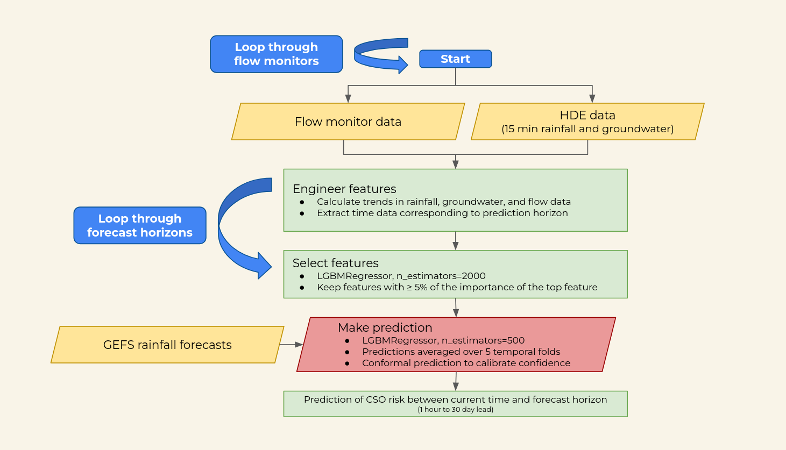
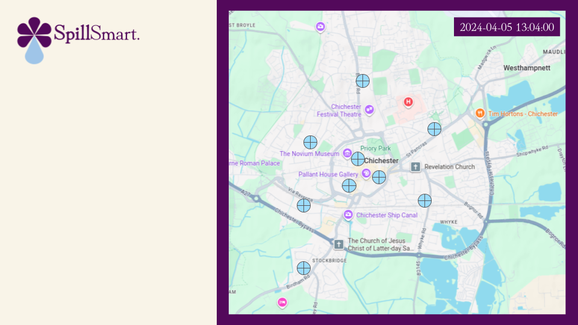
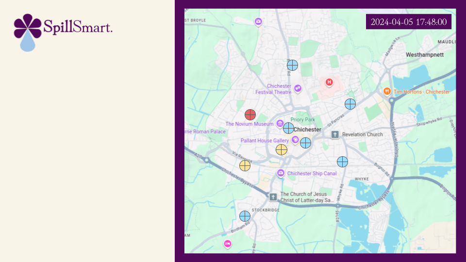
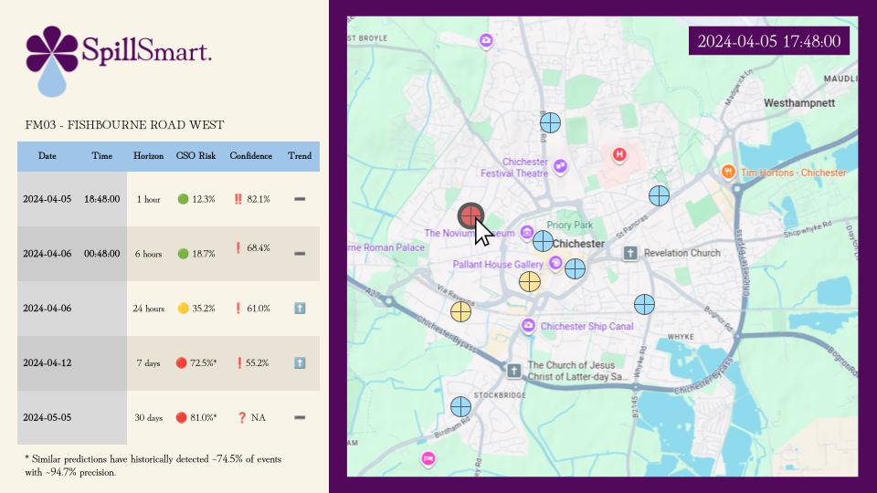

## Overview

This repository implements a **multi-horizon probabilistic forecasting system** for Combined Sewer Overflow (CSO) risk at flow monitoring stations.

The system:

* Ingests hydrological and infrastructure data
* Engineers time-series features
* Trains ensemble machine learning models
* Applies conformal prediction for calibrated confidence
* Selects the best model per station and horizon
* Generates scalable, structured predictions

---

# Model Concept

For each station and forecast horizon, the system predicts:

```text
P(CSO in next H hours | current state)
```

where:

* **H ∈ {1, 6, 24, 168, 720} hours**
* CSO is defined as:

  ```text
  fill_ratio_target > threshold (default = 0.95)
  ```

Predicting CSO exceedance probability is preferred operationally because:

* Predicting CSO exceedance probability aligns directly with operational decisions, as water companies act on the likelihood of overflow events rather than raw depth values
* It focuses on the physically relevant extreme by targeting peak behaviour, which is what actually drives CSO occurrence
* It is more robust to timing errors and rainfall forecast uncertainty, avoiding sensitivity to small misalignments in when peaks occur
* It enables calibrated probabilistic outputs, allowing risk to be expressed in a consistent and interpretable way
* It scales efficiently across networks and multiple forecast horizons, making it suitable for large operational deployments

While full depth trajectory forecasting provides richer detail, it is generally less stable, harder to interpret, and less directly actionable for real-world CSO management

---

# Pipeline Structure

## 1. Data Preparation (`prepare_station_data`)

### Inputs

* GEFS precipitation forecasts
* Rainfall (HDE)
* Groundwater (HDE)
* Flow data (Southern Water)
* Station metadata

### Processing steps

* Filter to station_id and alt_id
* Remove duplicates and invalid data
* Create complete 2-minute time grid
* Merge rainfall, groundwater, forecast data
* Interpolate short missing gaps (≤ 7 days)
* Compute:

  ```python
  fill_ratio = depth_mm / pipe_diameter_mm
  ```

---

## 2. Feature Engineering (`engineer_station_features`)

Transforms raw time series into predictive features.

### Categories of features

* **State variables**

  * fill_ratio, depth, flow, velocity
* **Rolling statistics**

  * max, mean, std over windows (10min → 24h)
* **Lag features**

  * past values at multiple horizons
* **Rates of change**

  * slopes, derivatives
* **Rainfall aggregates**

  * cumulative rainfall windows
* **Groundwater indices**

  * smoothed and lagged signals
* **Interactions**

  * e.g. rainfall × fill_ratio
* **Temporal encoding**

  * hour of day, day of year (sin/cos)
* **Binary regime indicators**

  * is_raining, is_surcharged

### Target

```text
fill_ratio_target = max(fill_ratio over next H hours)
```

---

## 3. Feature Selection (`select_kept_features`)

### Step 1: Permutation importance

* Train LightGBM regressor
* Evaluate on temporal validation fold

### Step 2: Thresholding

```python
importance_threshold = importance_frac * max_importance
```

Removes weak features.

### Step 3: Correlation grouping

* Features grouped if correlation ≥ 0.9
* One representative kept per group

### Output

```python
kept_features = [...]
```

---

## 4. Model Training (`build_cso_model`)



### Model type

* **LightGBM binary classifier**

### Target

```python
y = (fill_ratio_target > threshold)
```

---

### 4.1 Temporal Cross-Validation

* `TimeSeriesSplit(n_splits=5)`
* No leakage (strict forward chaining)

Each fold:

* train on past
* validate on future

---

### 4.2 Ensemble Prediction

```python
p = mean(p_fold_1, ..., p_fold_n)
```

This gives:

```text
P(CSO | features)
```

---

### 4.3 Conformal Prediction (Confidence)

Uses **out-of-fold predictions (`oof_prob`)**:

#### Nonconformity scores

```python
if y == 1:
    score = 1 - p
else:
    score = p
```

#### Threshold

```python
q_hat = quantile(nonconformity, 1 - alpha)
conf_threshold = 1 - q_hat
```

Interpretation:

> Predictions above `conf_threshold` are **statistically reliable**.

---

### 4.4 Fallback logic

If:

* no CSO events in training folds
* insufficient calibration data

Then:

* model falls back to:

  * persistence (fill_ratio)
  * no conformal confidence

---

## 5. Model Selection (`best_model_table.csv`)

For each **station × horizon**, best model is selected based on:

* performance metrics vs persistence
* ranking across metrics

Possible models:

* `Persistence`
* `EnsembleClassifier`
* `ConformalEnsemble`

---

## 6. Model Saving (`save_cso_model_artifacts`)

Each model is saved to:

```text
model/model_weights/{station_id}/{horizon}hr/
```

Contents:

* `model_bundle.joblib`
* `metrics.csv`
* feature list
* conformal calibration arrays

---

## 7. Prediction Pipeline

### Key idea

For each station and horizon:

1. Engineer features
2. Select best model from `best_model_table.csv`
3. Predict in **vectorized batches**

---

### Prediction outputs

For each timestamp:

| Field                  | Meaning                   |
| ---------------------- | ------------------------- |
| `risk_percent`         | P(CSO)                    |
| `risk_category`        | low / moderate / high     |
| `confidence_percent`   | conformal reliability     |
| `confidence_category`  | low / moderate / high     |
| `confidence_direction` | CSO / no CSO              |
| `trend`                | rising / falling / stable |
| `p_cso`                | conformal CSO evidence    |
| `performance_sentence` | model performance summary |

---

# Prediction Output (Parquet)

## File structure

One file per station:

```text
predictions/{station_id}.parquet
```

---

## Example data

| station_id | time             | horizon_hours | best_model         | risk_percent | risk_category | confidence_percent | confidence_category | confidence_direction | trend  | p_cso | performance_sentence |
| ---------- | ---------------- | ------------- | ------------------ | ------------ | ------------- | ------------------ | ------------------- | -------------------- | ------ | ----- | -------------------- |
| 8399       | 2024-01-01 00:00 | 6             | EnsembleClassifier | 18.7         | low           | 68.4               | moderate            | no CSO               | stable | 6.8   | Similar predictions… |
| 8399       | 2024-01-01 00:02 | 6             | EnsembleClassifier | 20.3         | low           | 65.7               | moderate            | no CSO               | rising | 7.9   | Similar predictions… |

---

## Accessing predictions

### Load full file

```python
df = pd.read_parquet("predictions/8399.parquet")
```

### Filter by horizon

```python
df[df["horizon_hours"] == 6]
```

### Latest predictions

```python
df.sort_values("time").groupby("horizon_hours").tail(1)
```

---

## Why Parquet?

* Efficient for large datasets (millions of rows)
* Columnar storage → fast reads
* Preserves types (no parsing needed)
* Ideal for analytics + ML pipelines

---

# Running the Pipeline

```bash
python model_pipeline.py --config config.yaml
```


---

# Example Interface



_View flow monitors in user-friendly dashboard_



_Watch risk change in real-time (updates every two minutes)_



_Click on flow monitor to get specific information about CSO risk, up to 30 days_
